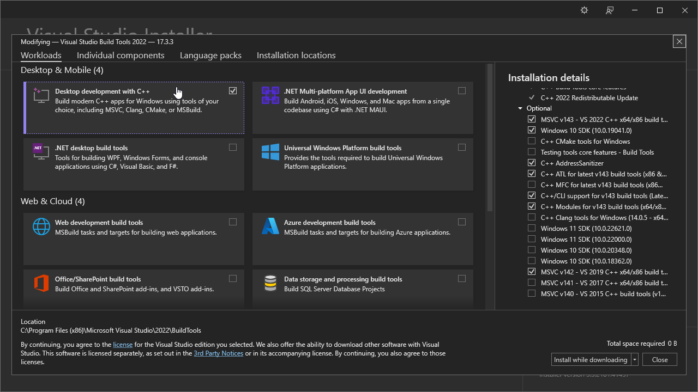

# A Simple Script To Compile Fedoraware In AVX2 Without Installing Visual Studio 20xx

# The Things We Need To Use This Script:

[Have Fedoraware Already Cloned/Extracted From Downloaded Zip](https://github.com/fedoraware/fedoraware)

[Git](https://git-scm.com/)

[Nuget](https://www.nuget.org/)

[Visual Studio Build Tools](https://visualstudio.microsoft.com/)


# Getting Ready To Use This Script:
First, Installing The Tools Necessary. To Do This As Cleanly And Efficiently As Possibly We're Going To Utilize, [Scoop A Package Manager.](https://Scoop.sh/) 
### Open A Powershell Command Prompt, NOT CMD. And Execute The Following Commands:

```
Set-ExecutionPolicy RemoteSigned -Scope CurrentUser
irm get.scoop.sh | iex
```

### Once Scoop Is Fully Installed, We Can Just Install (git is pre-installed as a part of scoop) Nuget Through Scoop By Using The Same Powershell Command Prompt With This Command:

```
scoop install nuget
```

### To Finalize The Installation For Nuget, We Have To Make Sure That It Can Retrieve Packages From The Official Source Without Issues, Else The Compile Will Fail. Go To %appdata%/Nuget And Open nuget.config With Notepad, And Then Replace The Contents Inside It With The Following Below: 
##### (You Are Free To Ignore This Step If You See "api.nuget.org" Inside The Config File)

```
<?xml version="1.0" encoding="utf-8"?>
<configuration>
  <packageSources>
    <add key="Nuget.org" value="https://api.nuget.org/v3/index.json" />
  </packageSources>
</configuration>
```


### Finally, We Install Visual Studio Build Tools, Which Is Installed Manually.
#### Head On Over To This Link And Download The Installer: https://visualstudio.microsoft.com/downloads/?q=build+tools#build-tools-for-visual-studio-2022 
#### Next, We're Going To Select Which Packages We're Going To Install, Follow The Image Below



#### But, If For Whatever Reason You Cannot See The Image, Make Sure To Tick The Box That Says "Desktop development with C++"

### That's It, Youre Now Finally Ready To Use the Script. (Make Sure You Have Cloned/Extracted A Zip Of Fedoraware Already!)

# Using The Script:
### First, Copy The Script To Wherever You Put Your Copy Of Fedoraware. Second, Open The Script In Notepad And Edit The Lines Where Your Old Copy Of Fedoraware Is And Where You Want The New DLL To Be Automatically Placed In.

### Second, After Having Installed Visual Studio Build Tools, Open Your Start Menu, Make Your Way To Visual Studio 2022, And Then Visual Studio Tools, And Finally Open "Developer PowerShell for VS 2022"

### Third, Enter The Following:
```
cd C:\Replace\Me\With\Where\Your\Copy\Of\Fedoraware\Is
```

### Fourth And Finally, Put ".\\" (Without Quotes) Before script.bat and press enter.  Enjoy your new compiled DLL. :smile:
